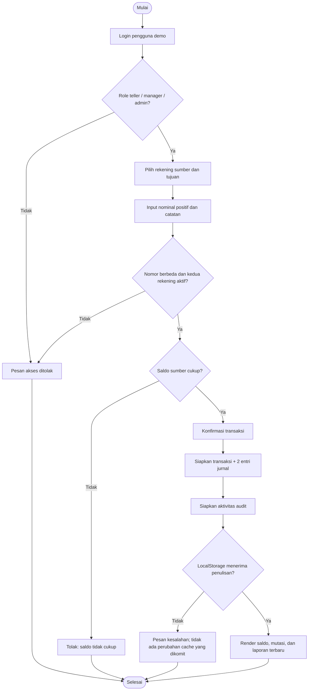
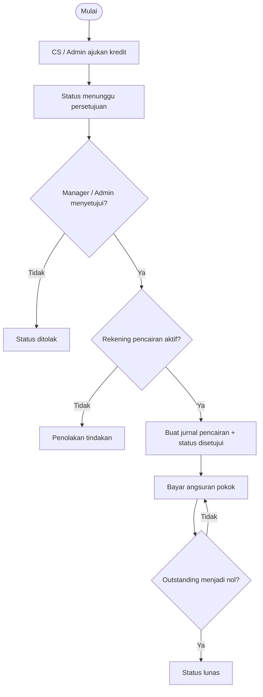

# Activity Diagram — Transfer Internal

```mermaid
flowchart TD
    A([Mulai]) --> B[Login pengguna demo]
    B --> C{Role teller / manager / admin?}
    C -- Tidak --> E[Pesan akses ditolak]
    C -- Ya --> F[Pilih rekening sumber dan tujuan]
    F --> G[Input nominal positif dan catatan]
    G --> H{Nomor berbeda dan kedua rekening aktif?}
    H -- Tidak --> E
    H -- Ya --> I{Saldo sumber cukup?}
    I -- Tidak --> J[Tolak: saldo tidak cukup]
    I -- Ya --> K[Konfirmasi transaksi]
    K --> L[Siapkan transaksi + 2 entri jurnal]
    L --> M[Siapkan aktivitas audit]
    M --> N{LocalStorage menerima penulisan?}
    N -- Tidak --> O[Pesan kesalahan; tidak ada perubahan cache yang dikomit]
    N -- Ya --> P[Render saldo, mutasi, dan laporan terbaru]
    P --> Q([Selesai])
    E --> Q
    J --> Q
    O --> Q
```

# Activity Diagram — Kredit

```mermaid
flowchart TD
    S([Mulai]) --> D[CS / Admin ajukan kredit]
    D --> W[Status menunggu persetujuan]
    W --> X{Manager / Admin menyetujui?}
    X -- Tidak --> Y[Status ditolak]
    X -- Ya --> T{Rekening pencairan aktif?}
    T -- Tidak --> R[Penolakan tindakan]
    T -- Ya --> J[Buat jurnal pencairan + status disetujui]
    J --> P[Bayar angsuran pokok]
    P --> Z{Outstanding menjadi nol?}
    Z -- Tidak --> P
    Z -- Ya --> L[Status lunas]
```
