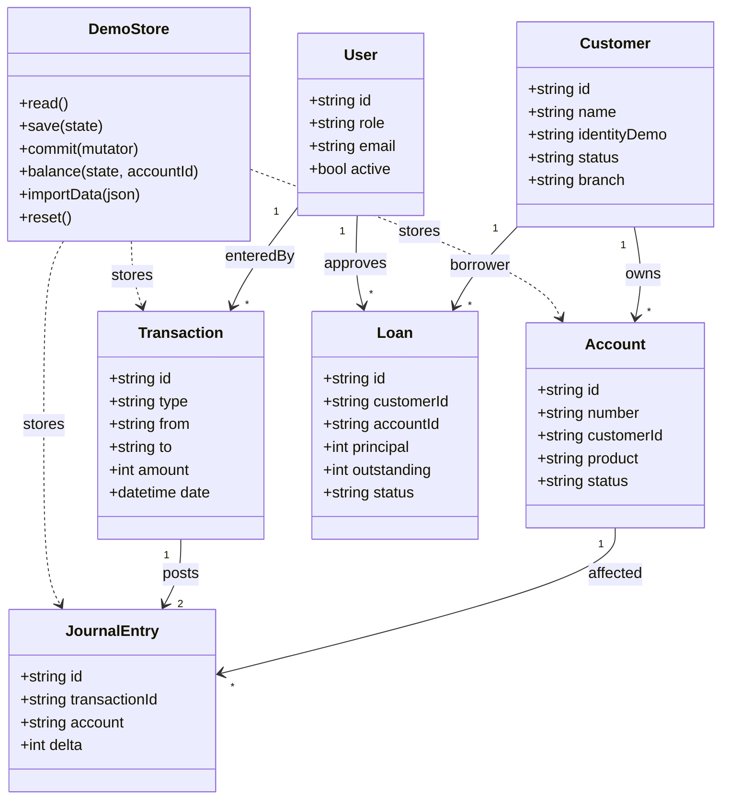

# Class / Domain Diagram — MILALA BANK

Diagram merupakan **rancangan konseptual**. Implementasi saat ini berbasis JavaScript object dan fungsi (bukan class OOP database).

```mermaid
classDiagram
  class Customer {
    +string id
    +string name
    +string identityDemo
    +string status
    +string branch
  }
  class Account {
    +string id
    +string number
    +string customerId
    +string product
    +string status
  }
  class Transaction {
    +string id
    +string type
    +string from
    +string to
    +int amount
    +datetime date
  }
  class JournalEntry {
    +string id
    +string transactionId
    +string account
    +int delta
  }
  class Loan {
    +string id
    +string customerId
    +string accountId
    +int principal
    +int outstanding
    +string status
  }
  class User {
    +string id
    +string role
    +string email
    +bool active
  }
  class DemoStore {
    +read()
    +save(state)
    +commit(mutator)
    +balance(state, accountId)
    +importData(json)
    +reset()
  }
  Customer "1" --> "*" Account : owns
  Customer "1" --> "*" Loan : borrower
  Account "1" --> "*" JournalEntry : affected
  Transaction "1" --> "2" JournalEntry : posts
  User "1" --> "*" Transaction : enteredBy
  User "1" --> "*" Loan : approves
  DemoStore ..> Account : stores
  DemoStore ..> Transaction : stores
  DemoStore ..> JournalEntry : stores
```
