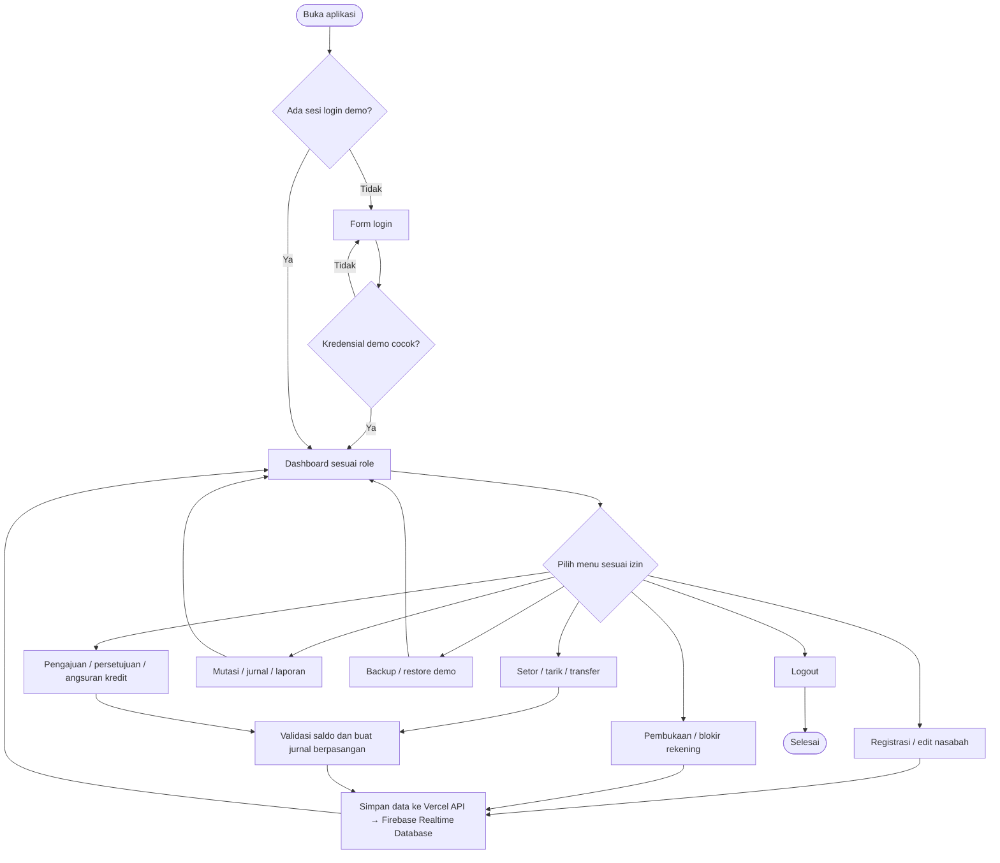

# Flowchart — MILALA BANK

```mermaid
flowchart TD
    A([Buka aplikasi]) --> B{Ada sesi login demo?}
    B -- Tidak --> C[Form login]
    C --> D{Kredensial demo cocok?}
    D -- Tidak --> C
    D -- Ya --> E[Dashboard sesuai role]
    B -- Ya --> E
    E --> F{Pilih menu sesuai izin}
    F --> G[Registrasi / edit nasabah]
    F --> H[Pembukaan / blokir rekening]
    F --> I[Setor / tarik / transfer]
    F --> J[Pengajuan / persetujuan / angsuran kredit]
    F --> K[Mutasi / jurnal / laporan]
    F --> L[Backup / restore demo]
    G --> M[Simpan data ke Vercel API → Firebase Realtime Database]
    H --> M
    I --> N[Validasi saldo dan buat jurnal berpasangan]
    J --> N
    N --> M
    M --> E
    K --> E
    L --> E
    F --> O[Logout]
    O --> P([Selesai])
```
