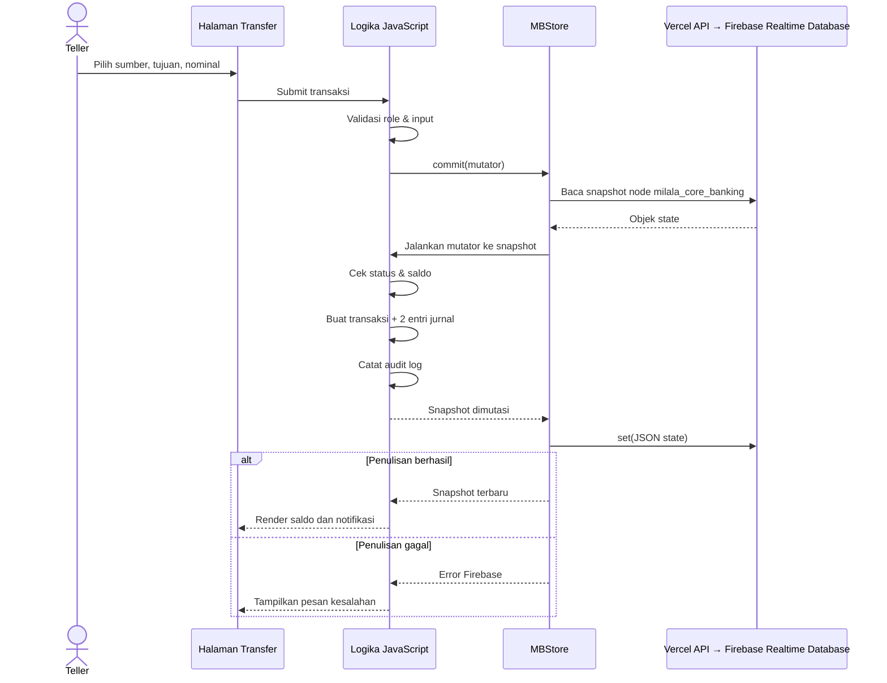
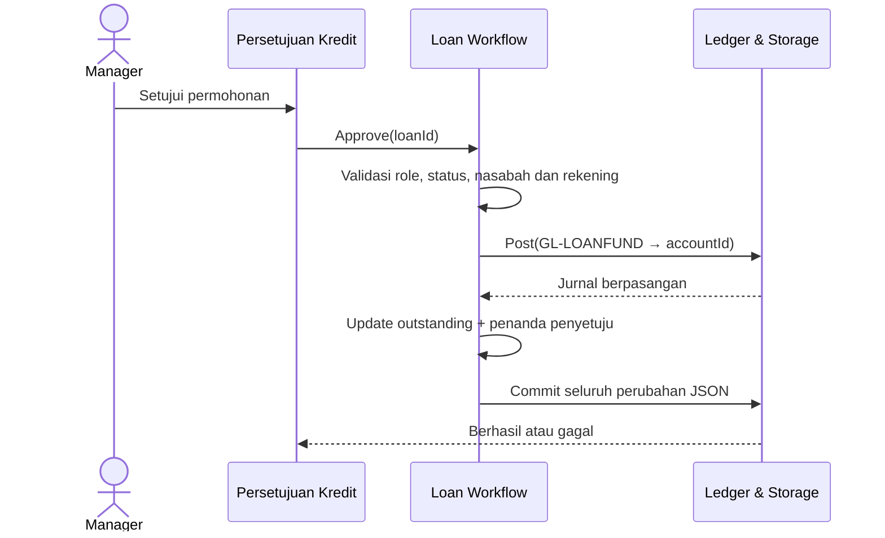

# Sequence Diagram — Transaksi Internal

```mermaid
sequenceDiagram
    actor Teller
    participant UI as Halaman Transfer
    participant App as Logika JavaScript
    participant Store as MBStore
    participant RTDB as Vercel API → Firebase Realtime Database
    Teller->>UI: Pilih sumber, tujuan, nominal
    UI->>App: Submit transaksi
    App->>App: Validasi role & input
    App->>Store: commit(mutator)
    Store->>RTDB: Baca snapshot node milala_core_banking
    RTDB-->>Store: Objek state
    Store->>App: Jalankan mutator ke snapshot
    App->>App: Cek status & saldo
    App->>App: Buat transaksi + 2 entri jurnal
    App->>App: Catat audit log
    App-->>Store: Snapshot dimutasi
    Store->>RTDB: set(JSON state)
    alt Penulisan berhasil
      Store-->>App: Snapshot terbaru
      App-->>UI: Render saldo dan notifikasi
    else Penulisan gagal
      Store-->>App: Error Firebase
      App-->>UI: Tampilkan pesan kesalahan
    end
```

# Sequence Diagram — Persetujuan Kredit

```mermaid
sequenceDiagram
    actor Manager
    participant UI as Persetujuan Kredit
    participant App as Loan Workflow
    participant Store as Ledger & Storage
    Manager->>UI: Setujui permohonan
    UI->>App: Approve(loanId)
    App->>App: Validasi role, status, nasabah dan rekening
    App->>Store: Post(GL-LOANFUND → accountId)
    Store-->>App: Jurnal berpasangan
    App->>App: Update outstanding + penanda penyetuju
    App->>Store: Commit seluruh perubahan JSON
    Store-->>UI: Berhasil atau gagal
```
