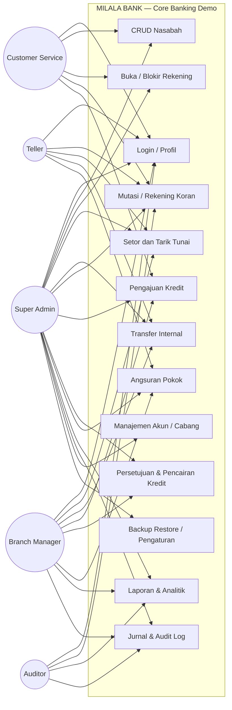

# Use Case Diagram — MILALA BANK

```mermaid
flowchart LR
    Admin((Super Admin))
    CS((Customer Service))
    Teller((Teller))
    Manager((Branch Manager))
    Auditor((Auditor))
    subgraph CBS["MILALA BANK — Core Banking Demo"]
      Login[Login / Profil]
      Customer[CRUD Nasabah]
      Account[Buka / Blokir Rekening]
      Cash[Setor dan Tarik Tunai]
      Transfer[Transfer Internal]
      Statement[Mutasi / Rekening Koran]
      Loans[Pengajuan Kredit]
      Approval[Persetujuan & Pencairan Kredit]
      Repay[Angsuran Pokok]
      Report[Laporan & Analitik]
      Audit[Jurnal & Audit Log]
      Users[Manajemen Akun / Cabang]
      Settings[Backup Restore / Pengaturan]
    end
    Admin --> Login & Customer & Account & Cash & Transfer & Statement & Loans & Approval & Repay & Report & Audit & Users & Settings
    CS --> Login & Customer & Account & Statement & Loans
    Teller --> Login & Statement & Cash & Transfer & Repay
    Manager --> Login & Cash & Transfer & Loans & Approval & Repay & Report & Audit
    Auditor --> Login & Statement & Report & Audit
```

Pembatasan hak akses ini hanya diproses di browser. Penyimpanan lokal tidak menyediakan keamanan untuk data bank nyata.
